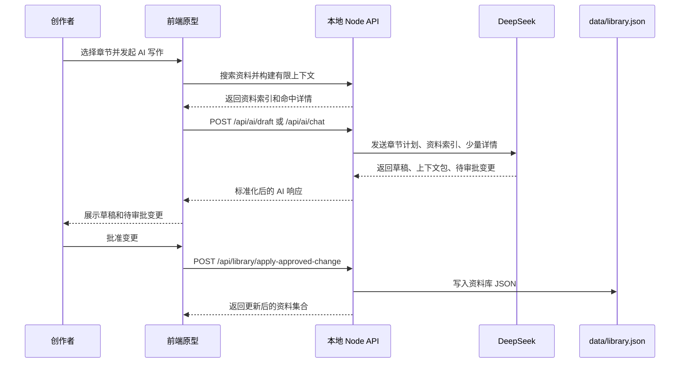

# 数据模型与 AI 流程

最后更新：2026-06-14

## 数据模型概览

项目当前使用 `schemaVersion: 2`。核心数据存放在前端状态和 `data/library.json` 中。

主要模型：

- `Project`：作品级信息，包括作品名、类型、简介、写作目标和全局风格。
- `LoreItem`：资料库条目，是人物、势力、地点、事件、线索、规则和年表的统一结构。
- `ChapterPlan`：章节计划，包括卷、章节目标、冲突、伏笔、禁用内容和状态。
- `AIContextBundle`：AI 本次使用的有限上下文。
- `AIProposedChange`：AI 提出的资料变更，等待用户审批。
- `ThemeConfig`：主题配置。

## LoreItem

`LoreItem` 是资料库最重要的数据结构。

```json
{
  "id": "shen",
  "type": "人物",
  "title": "沈青岚",
  "summary": "女主，灵契师，正在调查云氏家族密约。",
  "detail": "她擅长读取灵契残响，但无法伪造灵契。",
  "tags": ["主角", "灵契师", "王都"],
  "importance": "核心",
  "status": "有效",
  "relations": ["云氏家族", "旧王印", "星陨宴"],
  "fields": {
    "role": "女主",
    "ability": "读取灵契残响",
    "goal": "调查父亲旧案与云氏密约"
  },
  "links": [],
  "timeline": "星陨宴前后 3 日",
  "references": ["第 8 章", "第 12 章"]
}
```

关键字段说明：

| 字段 | 说明 |
| --- | --- |
| `id` | 稳定唯一标识 |
| `type` | 资料分类 |
| `title` | 用户可读标题 |
| `summary` | 列表和 AI 索引用摘要 |
| `detail` | 详情内容 |
| `tags` | 标签 |
| `importance` | `核心`、`高`、`中`、`低` |
| `status` | `有效`、`待验证`、`草稿`、`已归档` |
| `relations` | 人类可读关联名称 |
| `fields` | 类型相关结构化字段 |
| `links` | 结构化关系链接 |
| `timeline` | 时间线描述 |
| `references` | 引用章节或卷 |

## ChapterPlan

章节计划用于让 AI 写作时明确目标和边界。

```json
{
  "id": "ch12",
  "volume": "第 2 卷",
  "title": "第 12 章 星陨宴",
  "goal": "暗杀失败、暴露密约、推进沈青岚与云氏裂痕。",
  "conflict": "她必须在众目睽睽下保护真正目标。",
  "taboo": "禁止提前揭露旧王真实身份。",
  "status": "写作中"
}
```

`goal` 决定本章写作方向，`conflict` 提供戏剧张力，`taboo` 是 AI 必须避开的内容。

## AIContextBundle

`AIContextBundle` 记录 AI 本次引用的资料范围。

典型字段：

- `loreItemIds`：引用资料 ID。
- `relationHints`：关系提示。
- `timelineRefs`：时间线引用。
- `chapterId`：当前章节。

构建流程：

1. 前端读取资料索引。
2. 根据用户消息、章节目标、冲突、禁用内容和选中资料生成搜索 query。
3. 搜索命中资料详情。
4. 最多发送 6 条详细资料。
5. 把完整资料索引和有限详情发送给本地 AI 代理。

这让 AI 能知道资料全貌，但不会接收整库详情。

## AIProposedChange

AI 提出的资料变更不会立即写入资料库，而是进入审批列表。

```json
{
  "id": "ai-chat-change",
  "type": "新增",
  "title": "新增事件：AI 聊天线索",
  "reason": "用户要求 AI 新增事件线索。",
  "impact": "影响第 12 章后续调查。",
  "conflict": "无明显冲突。",
  "status": "待审批",
  "patch": {
    "loreItem": {
      "id": "ai-chat-clue",
      "type": "事件",
      "title": "AI 聊天线索"
    }
  }
}
```

支持的变更类型：

- `新增`
- `修改`
- `关联`
- `删除`

其中 `删除` 在当前原型中采用安全处理：批准后把目标资料标记为 `已归档`，并追加 `AI建议删除-已归档` 标签，而不是物理删除 JSON 记录。

## AI 权限边界

AI 可以：

- 读取资料索引。
- 读取本次命中的少量资料详情。
- 读取当前章节计划。
- 生成章节草稿或创作建议。
- 提出资料变更建议。
- 请求打开资料、章节、关系或设置弹窗。

AI 不可以：

- 直接写入 `data/library.json`。
- 绕过用户批准修改资料库。
- 接收整库详情或前端代码。
- 在未配置 DeepSeek 时生成伪造草稿。

## 审批写入流程



## 设计原则

项目的数据和 AI 流程遵循三个原则：

- 有界上下文：只发送当前任务需要的详情。
- 人工确认：所有设定变化必须由用户批准。
- 可追踪：AI 使用的资料和提出的变更都在界面上可见。
