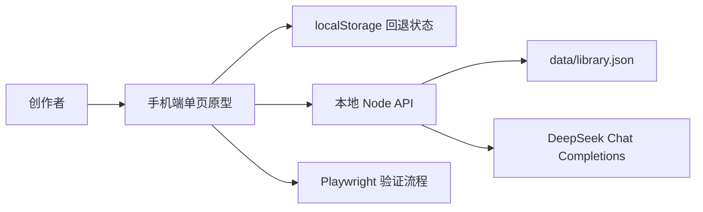

# 技术架构说明

最后更新：2026-06-14

## 架构概览

项目采用轻量原型架构：

- 前端：原生 HTML、CSS、JavaScript 单页应用。
- 服务端：Node.js `http` 模块实现的本地开发服务。
- 数据：`data/library.json` 作为本地资料库文件。
- AI：本地服务代理 DeepSeek OpenAI-compatible Chat Completions。
- 测试：Playwright smoke tests。

前端可以脱离服务端直接运行；服务端启动后，前端会优先使用 API 读写本地 JSON，并通过服务端调用 DeepSeek。



## 目录结构

```text
.
├── app.js                     # 前端状态、渲染、交互、AI 调用和资料 API 封装
├── data/
│   └── library.json           # 本地资料库 JSON
├── index.html                 # 单页应用入口
├── manifest.json              # PWA manifest
├── package.json               # npm 脚本和测试依赖
├── README.md                  # 快速说明
├── run-server.cmd             # Windows 快捷启动脚本
├── scripts/
│   └── check-deepseek.js      # DeepSeek 连接检查
├── server.js                  # 本地静态服务、资料 API、AI 代理
├── styles.css                 # 移动端原型样式和主题
└── tests/
    └── prototype-smoke.spec.js # Playwright 核心流程测试
```

## 前端设计

`app.js` 使用集中式状态对象驱动渲染。核心状态来源有两个：

- 初始样例状态 `seedState`。
- 浏览器 `localStorage` 中的 `ai-novel-prototype-state`。

关键前端模块：

- 状态加载与迁移：`loadState`、`normalizeAppState`、`normalizeLoreCollection`。
- 资料访问封装：`LibraryDataAPI`。
- 页面渲染：`renderAI`、`renderLibrary`、`renderOutline`、`renderGraph`、`renderSettings`。
- 弹窗渲染：资料详情、新建资料、章节详情、关系详情、设置面板、AI 上下文。
- AI 流程：`buildAIContextPayload`、`callAI`、`generateDraft`、`askAI`、`approveChange`。
- 主题切换：`THEMES`、`applyTheme`。

前端优先尝试服务端 API。如果当前是直接打开 `file://`，或者 API 请求失败，会自动回落到本地状态和 `localStorage`。

## 服务端设计

`server.js` 使用 Node 内置 `http` 模块，不依赖 Express。它承担三个职责：

- 提供静态文件服务。
- 读写 `data/library.json`。
- 代理 DeepSeek 请求，避免前端直接访问 DeepSeek。

主要 API：

| 方法 | 路径 | 说明 |
| --- | --- | --- |
| `GET` | `/api/config` | 返回 DeepSeek 默认配置和服务端 Key 是否存在 |
| `GET` | `/api/library/state` | 返回完整资料库状态 |
| `GET` | `/api/library/index` | 返回资料索引 |
| `GET` | `/api/library/items/:id` | 返回单条资料详情 |
| `POST` | `/api/library/search` | 搜索资料并返回索引和有限详情 |
| `POST` | `/api/library/items` | 新建资料 |
| `PUT` | `/api/library/items/:id` | 更新资料 |
| `POST` | `/api/library/apply-approved-change` | 应用已批准的 AI 资料变更 |
| `POST` | `/api/ai/test` | 测试 DeepSeek 连接 |
| `POST` | `/api/ai/draft` | 生成章节草稿 |
| `POST` | `/api/ai/chat` | 聊天式创作请求 |

## 运行模式

### 纯前端模式

直接打开 `index.html`。

特点：

- 不需要 Node 服务。
- 资料保存在浏览器 `localStorage`。
- 无真实 DeepSeek 调用。
- 适合快速查看 UI 原型。

### 本地服务模式

运行：

```bash
npm run dev
```

访问：

```text
http://localhost:4173
```

特点：

- 静态文件由 `server.js` 提供。
- 资料优先读写 `data/library.json`。
- 可以通过 `.env.local` 或设置页配置 DeepSeek。
- 适合验证完整 AI 写作和资料审批闭环。

## 数据一致性策略

前端和服务端都实现了资料标准化逻辑，保证旧数据和表单输入能被规范成统一结构。主要策略：

- 类型别名迁移，例如 `世界规则` 会归一到 `世界观/规则`。
- `relations` 和 `links` 互相补充，生成可展示关系。
- 家族/势力的 `members`、`allies`、`enemies` 会同步为结构化链接。
- AI 批准变更后重新标准化资料集合。

这种设计让原型在没有正式数据库的情况下，也能模拟相对稳定的数据契约。

